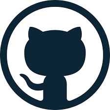

# revisaogit-comandos
Repositórios para comando do git

## O que é Markdown?

O **Markdown** é uma
lingua bem *legal*

Comando do ~~markdown~~

Documentação do [MarkDown](https://pages.github.com/)

1. Abacate
2. Melacia
3. Abacaxi

- Games
- Filmes
- Musicas

Como colocar uma imagem

